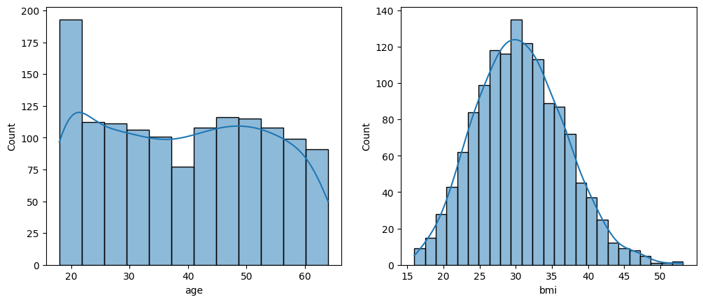
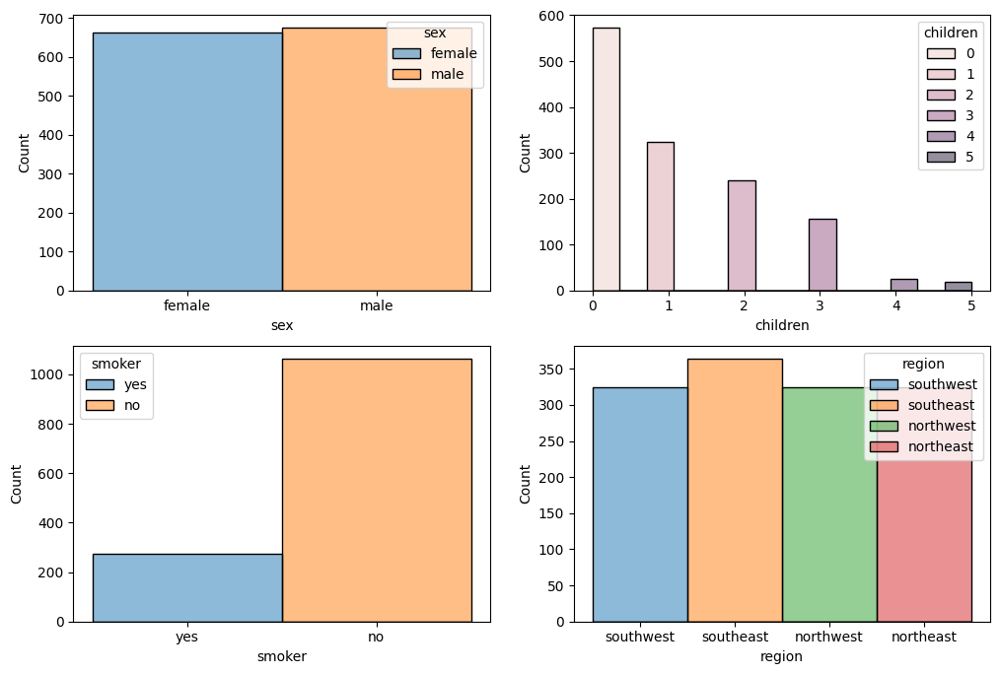

# Annual Medical Expenditure Estimation

## Data Analysis

First things first, I want to perform rudimentary data analysis to understand the insurance data I got from kaggle. 

I load up the data in a dataframe and take a look at the output of the describe method.

The avg customer of ACME insurance sounds like this - 40 years old with a BMI of 30 and with 1 child. This avg customer racks up an avg medical charge of 13300$.

This is an avg picture and not a very illuminating one at that. I want to dig deeper.

The data has 3 continuous variables -- ***\[age, bmi, charges]*** and 4 categorical variables -- ***\[sex, children, smoker, region, (later,bmi category)]***. I first want to see the distribution of the continuous variables. Below are the histograms ploted for age and bmi variables.

Customer age is mostly uniformly distributed apart from a spike in the 18-22 age range. Customer BMI looks like a normal distribution and there doesn't seem to be any anamalous trends.

When we plot the categorical variables we see that the data is not exactly uniform.

The customer sex distribution is pretty uniform between male/female. Shame this isn't an inclusive dataset. Regions that the customers belong to also seems to be uniformly distributed.

But when we take a look at the number of children that the customers have, we see that a large majority of them are childless. Customers with 4,5 children are less than 100 combined while childless customers are between 500-600.

Customers who don't smoke seem to outnumber the smokers by 5:1 ratio. This dataset is heavily skewed towards non smokers and childless people. 

If we build a regression model using this dataset, the model might not generalize properly and have troubles predicting the medical charges of a chain smoking mom with 5 children.

## Regression Model - Expenditure estimator